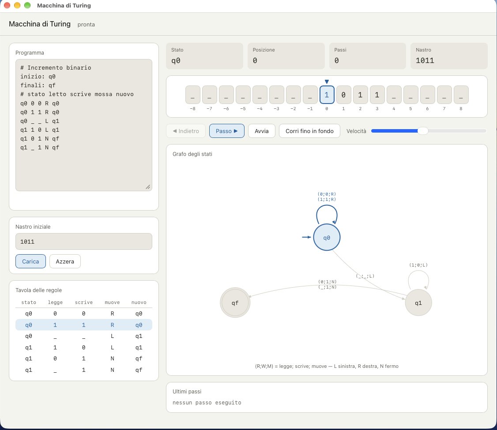

# Turing Machine

*[Versione italiana](README.md)*

A teaching simulator for Turing machines, with an infinite tape, step-by-step
execution, a rule table and a state graph. It is a desktop application written
in Go with [Wails](https://wails.io): the engine is Go, the interface is a web
page with no external dependencies, and the whole thing ships as a single
executable.

The interface is in Italian.



## What a Turing machine is

It is the model of computation Alan Turing described in 1936, and it still
defines what "computable" means today. Its power lies in being the simplest
thing that can still compute everything computable. There are four
ingredients, and you can find all of them in the interface:

- **The tape**, divided into cells, each holding one symbol. It is potentially
  infinite: here it extends in both directions, and every cell never written
  to holds the blank symbol `_`.
- **The head**, which reads the cell beneath it, may rewrite it, and moves one
  position left or right, or stays put.
- **The state register**, which remembers which state the machine is in.
  States are not memory: they are the handful of named situations the machine
  can find itself in.
- **The instruction table**, which for every (state, symbol read) pair says
  what to write, where to move, and which state to enter next.

That is all there is. No variables, no numbers, no arithmetic: adding two
numbers means moving a head back and forth while rewriting symbols. Watching
it happen is the best way to understand why Turing's result is so surprising.

## Program format

A program is a list of **quintuples**, one per line, in the form:

```
state  read  written  move  new_state
```

The move is `L` (left), `R` (right) or `N` (none); the Italian `S`, `D` and
`F` are accepted as well. Lines starting with `#` are comments, and two
directives declare the initial and final states. Both keywords are Italian —
`inizio` means "start" and `finali` means "final":

```
inizio: q0
finali: qf
```

The machine halts when it enters a final state, or when no rule exists for the
current (state, symbol read) pair. Programs must be **deterministic**: two
rules for the same pair are rejected at load time, with the conflicting line
numbers reported.

### Example: binary increment

The program loaded at startup adds 1 to a binary number written on the tape:

```
# Binary increment
inizio: q0
finali: qf

q0 0 0 R q0      # run right, leaving the digits untouched
q0 1 1 R q0
q0 _ _ L q1      # blank found: the number ended, step back

q1 1 0 L q1      # 1 plus carry makes 0, and the carry keeps going
q1 0 1 N qf      # 0 plus carry makes 1, carry absorbed: done
q1 _ 1 N qf      # it was all ones: write a new leading 1
```

State `q0` has a single job, reaching the end of the number; `q1` stands for
"I have a carry to settle". Try it with `1011`, which becomes `1100`, and then
with `111`: the carry travels across the whole number and exits on the left,
writing into cell `-1`. This works with no tricks only because the tape is
infinite in both directions.

## The two views

The same rules are shown in two complementary ways. The **table** lists them
as you wrote them, and is the textual view. The **state graph** shows them as
structure: each state is a node, each transition an arrow labelled `(R;W;M)`,
that is symbol read, symbol written, move. The self-loop on `q0` tells you at a
glance that this state "runs right as long as it reads digits".

Both views highlight the current state and the rule about to fire: before
pressing *Passo* (step), try to guess which one will light up.

Beyond twelve states the graph stops being readable, and the view switches
automatically to the state register alone: one large node whose label changes
as the machine walks.

## Controls

| Control | Keyboard | Effect |
|---|---|---|
| Passo (step) | → | Performs a single transition |
| Indietro (back) | ← | Undoes the last step |
| Avvia / Pausa (run / pause) | space | Animated execution, adjustable speed |
| Corri fino in fondo (run to the end) | | Runs until it halts, no animation |
| Azzera (reset) | | Restores the tape to its initial configuration |

*Indietro* works because every step leaves behind a record of the
configuration as it was: undoing is therefore always possible, at any depth.

## Installing

Prebuilt packages are on the [releases](../../releases) page. The macOS
package is universal, so it runs on both Apple Silicon and Intel.

The application is **self-signed**, not signed with a paid Apple certificate,
so macOS blocks it on first launch. To open it anyway, right-click the icon
and choose *Open*, then confirm in the dialog. From the terminal:

```bash
xattr -dr com.apple.quarantine "/Applications/Macchina di Turing.app"
```

This is the usual Gatekeeper protection against applications distributed
outside the App Store, and says nothing about what the program contains: the
source is all here, and you can build it yourself following the next section.

## Building

You need [Go](https://go.dev) 1.25 or later and the Wails v2 command line:

```bash
go install github.com/wailsapp/wails/v2/cmd/wails@v2.15.0
```

Then, from the project root:

```bash
wails dev      # run with automatic frontend reload
wails build    # executable in build/bin
go test ./tm/  # engine tests
```

On macOS the Xcode command line tools are required
(`xcode-select --install`). The frontend is plain HTML, CSS and JavaScript
with no framework, so there is nothing for npm to build.

## Architecture

The project is split into two halves that know nothing about each other.

Package `tm` is the engine: tape, rules, execution, step records and the graph
structure. It performs no input or output, does not know a window exists, and
is covered by tests. The infinite tape is built from two slices, one for
non-negative cells and one for negative ones, growing only when the head
actually writes there.

The rest is the application. `app.go` is the binding layer: it exposes `Load`,
`Step`, `Back`, `Run` and `Reset` to the frontend, each returning a *snapshot*
of what needs displaying. The frontend, in `frontend/dist`, holds no machine
logic at all: it calls a method and redraws whatever comes back.

The separation is deliberate: whatever does not change during execution (rule
table, graph, node positions) crosses the boundary once at load time; each
step carries only what changed.

Source comments and identifiers are in Italian.

## License

MIT
